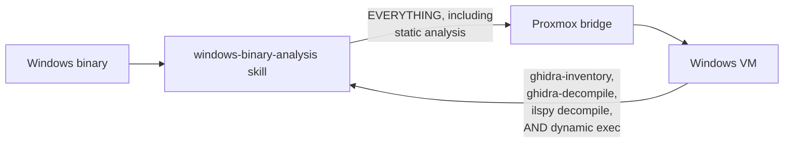
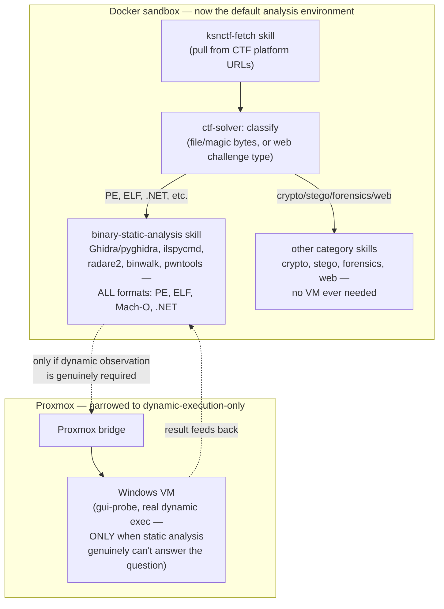

# CTF Generalization — Architecture Design

Status: proposal, not yet implemented. Written to be reviewed and revised
before any code changes begin.

## The key insight driving this redesign

**Ghidra (and therefore `pyghidra_tool.py`'s `ghidra-inventory`/
`ghidra-decompile`) analyzes a binary as data, not as code it executes.**
It is Java-based and works identically on Linux, regardless of what
platform the *target* binary was built for. The same is true of
`ilspycmd` — a cross-platform .NET Core global tool, not a
Windows-specific one, despite decompiling Windows `.exe`s.

**The only thing that genuinely requires the Windows VM is dynamic
execution** — actually running the target binary, `gui-probe`. Every
static-analysis step built this session — `ghidra-inventory`,
`ghidra-decompile`, the .NET `decompile` path — has no real dependency on
Windows at all, and could run directly in the Docker sandbox with zero
Proxmox round-trip.

This isn't a minor optimization. Tonight's entire `Riddle.exe` session —
every inventory dump, every decompile, the full RC4 reconstruction — could
have been done without cloning a VM at all. The 30-60 minute clone wait,
the guest-agent flakiness, the marker races, the template-guard risk —
none of that needed to be in the critical path for most of tonight's
actual work. It only becomes necessary at the very last step, if dynamic
observation is genuinely required.

## Current state (before this redesign)



Every request — static or dynamic — pays the VM's cost and risk profile,
even when nothing in that specific request needed a VM at all.

## Proposed architecture



## Component-by-component redesign

### 1. Docker sandbox image — pre-bake tooling, don't ad hoc install it

Currently the sandbox installs what it needs per-session via `pip`/`apt`.
For a setup meant to run repeatedly, that's real recurring cost and a real
recurring failure surface (network flakiness, version drift). Worth
building a purpose-made image the same way the Windows golden template was
built — bake the tools in once, reuse forever.

Candidate additions to `docker/hermes-sandbox.Dockerfile`, organized by
category (no priority ordering — the goal is breadth across categories,
not depth in any one):

**Binary analysis / reverse engineering**
- **OpenJDK** + **Ghidra** + **PyGhidra** (installed the same offline-wheel
  way validated tonight)
- **.NET SDK** + **ilspycmd**
- **radare2** or **rizin** (a second, lighter static-analysis angle)
- **rp++** (`rp-lin`) — ROP gadget finder
- **ROPgadget**, **one_gadget** — pwn/exploitation gadget-finding
- **checksec** — binary protection/mitigation inspection
- **ltrace**, **strace** — dynamic call tracing (Linux targets; no VM
  needed at all for this category)
- **pwntools** (Python) — the standard pwn/exploitation toolkit

**Password / credential attacks**
- **Hydra** — network login brute-forcing
- **fcrackzip** — password-protected zip cracking
- **John the Ripper**, **hashcat** — general password/hash cracking
  (implied by the password-attack category even though not explicitly
  named)

**Web application security**
- **nikto** — web server vulnerability scanner
- **dirb**, **dirbuster** — directory/content discovery
- **OWASP ZAP** — the primary automatable web-proxy tool; has a genuine,
  well-documented headless/API mode (`zap-baseline.py`, the ZAP API),
  making it realistically drivable from a model-issued shell session.
  Burp Suite considered and dropped — no comparable headless/API story
  in the Community edition, and ZAP already covers this role.
- **sqlmap** — automated SQL injection

**Network**
- **netcat** — already a near-universal base-image inclusion
- **scapy** (Python) — packet crafting/analysis

**Forensics / steganography / misc**
- **binwalk**, **exiftool**, **steghide**, **foremost**
- **zsteg** — the real headless-native alternative to stegsolve: a Ruby
  tool that scans PNG/BMP images across bit/channel/pixel-order
  combinations and reports anything that looks like text, a known file
  signature, or a high-entropy region, with an `-a` flag to exhaustively
  try every known combination. This does systematically, from a single
  command, what stegsolve requires a human to click through by hand —
  confirmed as fully sufficient to replace it for this project's
  purposes.
- **stegoveritas** — Python-based, broader format coverage
  (JPG/PNG/GIF/TIFF/BMP); runs LSB brute-forcing, metadata checks,
  per-channel LSB extraction, and steghide checking from one command — a
  good single first-pass tool.
- **stegseek** — a fast, headless dictionary-attack cracker for
  password-protected steghide content, covering the one gap
  zsteg/stegoveritas don't (cracking rather than detecting).
- **Tesseract OCR** — image-to-text extraction, useful for CAPTCHA-style
  or image-embedded-flag challenges. Tesseract's own bundled standard
  trained-data models are sufficient for a starter; no separate MNIST
  dataset needed unless a genuine digit-recognition-specific challenge
  category comes up later.
- a code beautifier/formatter (e.g. `js-beautify`) — useful for
  obfuscated JS/minified-code challenges

**Static-analysis Python libraries**
- **pefile**, **pyelftools**, **capstone** — lighter-weight alternatives
  to full Ghidra for quick checks

### 2. Skill restructuring — split by "does this need a VM," not by target OS

**New: `binary-static-analysis` skill (Docker-native, format-agnostic)**
Takes over `ghidra-inventory`, `ghidra-decompile`, and the .NET
`decompile` path from the current `windows-binary-analysis` skill,
generalized to work on any binary format Ghidra supports (PE, ELF,
Mach-O), not just Windows PEs. Runs entirely inside the Docker sandbox.
No VM, no bridge, no clone wait, for the majority of analysis work.

**Narrowed: `windows-dynamic-execution` skill (Proxmox-backed)**
What remains of the current `windows-binary-analysis` skill, stripped down
to genuinely VM-dependent operations: `start`/`push`/`exec` for actually
running a binary, `gui-probe`. Reached only when static analysis has been
exhausted and dynamic observation is specifically what's needed — matching
the "professional standard" principle already established in `SKILL.md`:
execution is one legitimate technique among several, not the default.

### `ksnctf-fetch` (renamed from `challenge-fetch`) — detailed technical design

**Renamed for honesty.** Its actual classification logic (file
extensions, metadata regex, SSH-format pattern) is entirely tuned to
ksnctf's real confirmed structure — giving it a platform-neutral name was
quietly misleading, the same mistake already avoided when naming
`ksnctf-submit`. A future platform needs its own equivalent skill
(`htb-fetch` or similar), not a generic one pretending to already
support it.

**Fetching mechanism.** A plain Python script using `requests` (already
in the sandbox), matching the pattern of every other skill in this
project (`analyze_windows_binary.py`, `binary_analysis.py`) — a
structured, testable script rather than relying on Hermes's own
general-purpose browsing behavior for something that needs to behave
consistently every time.

**Classification is not mutually exclusive by design.** Since there's no
API telling us which mode a problem uses, classification runs all three
detectors against the fetched page and reports every match — never forces
a single guess. A problem could plausibly combine modes (a downloadable
file *and* a web component), and picking one incorrectly would silently
hide the other.

Heuristics per mode:
- **Downloadable file**: `<a href="...">` links matching a broad set of
  confirmed real extensions (`.exe`, `.zip`, `.pcap`, `.docx`, `.apk`,
  `.cpp`, `.html`, and generally anything that isn't an obvious internal
  navigation link) — download the file(s) found, stage into `/workspace`.
- **Embedded web application**: presence of `<form>` elements, login
  fields, or a URL pointing at the confirmed live-target host
  (`ctfq.u1tramarine.blue` for ksnctf) — extract the exact target URL.
  May co-occur with a downloadable "source" file for the same problem —
  don't treat finding one as excluding the other.
- **Direct SSH access**: primary extraction via a precise regex matching
  the confirmed consistent template (`ssh <user>@<host> -p <port>`
  followed by a `Password: <pw>` line) — reliable enough to structure-
  extract host/port/user/pass directly rather than only surfacing raw
  text. Fall back to surfacing the raw matched region if the regex
  doesn't match, rather than guessing at a looser pattern.

**Scope constant for ksnctf specifically**: `ctfq.u1tramarine.blue`,
confirmed directly from the site's own stated policy ("please do not
attack anything other than ctfq.u1tramarine.blue") and independently
verified as the actual host behind real SSH and web-app examples. This
value belongs in `AGENTS.md` as shown above, not in any script.

**Script interface (planned, not yet built):**
```
python3 ksnctf_fetch.py --scope <allowed_host> fetch <problem_url>
```
`--scope` is required for any problem that might involve a live-target
mode (web-app or SSH); the agent sources this value from `AGENTS.md`'s
current-scope section, never hardcoded or auto-derived. Outputs
structured JSON: title, point value, release date (free metadata
extraction, confirmed available on every real problem page), which
mode(s) matched, downloaded file paths (if any), the extracted web-app
target URL (if any) — checked against `--scope` and flagged if it
doesn't match — and extracted SSH connection details or raw matched text
(if any).

**Where scope-enforcement actually lives — a deliberate two-layer
design, not solved entirely in this one skill:**
1. The agent reads the current scope from `AGENTS.md` (see above) and
   passes it explicitly into `ksnctf-fetch` as a parameter. The skill
   itself doesn't derive or guess scope from page content — that would
   reintroduce exactly the fragile-parsing problem `AGENTS.md`-as-prose
   was chosen to avoid. `ksnctf-fetch`'s job is acquisition; scope is
   an input it receives, not something it figures out.
2. Actually *enforcing* that scope against tool invocations (`nikto`,
   `sqlmap`, `dirb`, raw `requests` calls) is the responsibility of
   whatever web-application-attack skill gets built next — it should
   receive the same explicit scope parameter and refuse to run any scan
   against a host that doesn't match it. Splitting it this way keeps
   `ksnctf-fetch` focused purely on acquisition, while still making
   the actual enforcement a real, checked constraint rather than prose in
   a skill doc — just implemented one layer downstream from where the
   scope value is actually sourced (a human editing `AGENTS.md`).

### `ksnctf-discover` (new) — building the full problem list, the way a human would

Confirmed via real HTML inspection, not assumed: ksnctf's homepage
contains a genuinely static, server-rendered list of every problem —
`<a class="dropdown-item" href="/problem/N">N: Title</a>` for all 41
problems, no JavaScript/API layer needed to discover the full set. This
initially seemed uncertain given the same site's flag-submission
mechanism turned out to be entirely JS-driven — worth having checked
directly rather than assumed either way, since the two turned out to
work completely differently.

**Deliberately simplified after review**: an earlier draft of this
design sorted problems by ascending point value before traversal,
requiring a second discovery stage (visiting all 41 problem pages
individually just to read each one's points, before any real work could
begin). Reconsidered and dropped — it assumed every platform exposes a
comparable "points" field usable as a difficulty proxy, which isn't a
safe assumption at all (HTB's scoring works completely differently), and
it would have meant rework the moment a second platform is added.
Simpler and more genuinely platform-agnostic: process problems in
whatever order the discovery script naturally returns them — for ksnctf,
that's just the homepage's own listing order. This also means discovery
is now a single, cheap fetch — no second per-problem stage needed at
all.

**Script interface (planned):**
```
python3 ksnctf_discover.py list
```
Outputs a JSON array of `{id, title, url}`, in the platform's own
natural order — no engineered sort applied.

### The traversal engine — platform-blind by design, not hardcoded to ksnctf

**The core architectural requirement**: ksnctf is explicitly a starting
point, not a destination — the plan is to move to HTB or others later.
The traversal engine (ordering, attempt-tracking, reachability-skipping)
needs to be genuinely reusable across platforms, not rewritten each
time. The earlier draft of `ctf_solver.py` didn't yet reflect this — it
called `ksnctf-fetch`/`binary-static-analysis` by hardcoded path,
which is fine for the read-only analysis step (genuinely
platform-agnostic already) but wrong for anything platform-specific.

**Resolved by taking discovery and submission as explicit parameters**,
the same pattern already established for `--scope`:
```
python3 ctf_traversal.py run --discover <path-to-discover-script> --submit <path-to-submit-script> --scope <allowed_host>
```
The agent sources both script paths from `AGENTS.md`'s current-scope
section (which should list which platform-specific skills are active,
alongside the scope value already there) — today that's
`ksnctf-discover`/`ksnctf-submit`; a future HTB integration means adding
`htb-discover`/`htb-submit` and updating that one section, with zero
changes to `ctf_traversal.py` itself.

**Deliberately not over-engineered into a full plugin system.** With
only one real platform's structure confirmed so far, designing a generic
abstraction against a platform (HTB) that hasn't been researched at all
risks guessing the wrong shape. Explicit script-path parameters are
flexible enough for what's actually known right now, without inventing
speculative structure for what isn't.

**Ordering and traversal**: process problems in the order `ksnctf-discover`
naturally returns them (its own listing order — no engineered sort),
using exhaust-then-advance — attempt a problem until either the correct
flag is found or its 5-attempt cap (enforced inside `ksnctf-submit`
itself) is exhausted, then move to the next problem.

**On authentication — not solved now, but not blocked either.** Unlike
ordering, this is a genuinely hard, load-bearing problem for
generalizing beyond ksnctf: platforms like HTB require actual
login/session management just to enumerate or access problems at all,
where ksnctf needs none. The current interface already absorbs this
without requiring any changes to the traversal engine itself — each
platform's own `--discover`/`--submit` scripts are responsible for
handling their own authentication internally (session cookies, tokens,
whatever a given platform needs); the traversal engine only ever sees a
valid problem list or a valid submit result, never how it was obtained.
Nothing to build for this today, since ksnctf doesn't need it — but
worth keeping in mind as a real, known requirement for whatever a future
`htb-discover`/`htb-submit` pair turns out to need, rather than
something to design speculatively now without a real platform to build
against.

### `next` was silently abandoning `in_progress` problems forever — found via a deliberate two-session test

Confirmed directly, not theorized: `cmd_next()`'s original filter was
`if info["status"] != "pending": continue`. The instant a problem was
first handed out it flipped to `in_progress` — a status that is
neither `pending` nor terminal — and from that point on, every future
`next` call's own filter skipped it permanently, for any reason,
whether or not it was ever actually solved. `"done": true` fires once
nothing remains `pending`, regardless of how many problems sit
abandoned mid-derivation at `in_progress`.

This was caught by a deliberate test: run one session to work a
problem partway (without solving it), then run a second session
immediately after and check whether it ever revisited the first's
work. It didn't — `next` handed the second session an entirely
different, fresh `pending` problem instead, and traced to source
confirmed why: the first problem was structurally ineligible to ever
be returned again. This matters far beyond that one test — every
recovery mechanism this design documents for unfinished work (progress
notes, the session-export archive, both described above) was being
written for problems `next` would never route back to, silently
undermining the whole point of building them.

Fixed by broadening the filter to `if info["status"] not in
("pending", "in_progress"): continue`, walking the same natural
discovery order for both statuses — an `in_progress` problem is now
picked up again before any later `pending` one, rather than being
skipped forever the moment something else gets attempted.
Deliberately not building anything more elaborate (no priority
scoring, no "N consecutive re-returns forces a skip" heuristic): if an
agent keeps getting the same problem back without ever calling
`submit`, that's a stuck-agent problem to diagnose on its own terms,
not something the traversal engine should paper over speculatively.

### `load_state`/`save_state` had zero concurrency protection — a second, older bug surfaced while checking the first fix

Found while investigating an unrelated-looking symptom: two problems
that had correctly reached `in_progress` (with real, logged submission
attempts against them) were later found reverted back to `pending`,
with their attempt counts untouched. Traced to source rather than
guessed at: `load_state()` does a plain full-file read, `save_state()`
does a plain full-file overwrite, and neither has ever had any locking
at all. Grepping every place the literal string `"pending"` gets
written confirmed it happens exactly once — the initial default set
during `init` — so no combination of `next`/`submit` calls can produce
this pattern through their own documented logic alone.

The actual mechanism: any process that calls `load_state()`, does
real work for a while — sessions running over an hour on a single
turn aren't unusual for a hard problem — and only then calls
`save_state()`, silently overwrites *everything* with its own
now-stale in-memory snapshot, discarding whatever any other process
legitimately changed in between that process's own load and save.
This is a pre-existing bug independent of the `in_progress` fix above
and of anything built earlier tonight — it has been present since
`ctf_traversal.py` was first written, just hadn't previously surfaced
as a *visible* problem, since a lot of the state this could clobber
(status transitions) is either idempotent or, before tonight's fix,
happened to only move in directions that made the corruption easy to
overlook.

Fixed with `state_lock()`, an `fcntl.flock`-based exclusive lock (a
separate lock file, not the state file itself) wrapped around each
write-capable subcommand's *entire* load-modify-save span — not just
around the individual file operations inside `load_state`/`save_state`,
since the race is about time elapsing between load and save, not
about either read or write being individually unsafe. `flock()` blocks
rather than failing, so a second process queues behind the first
rather than erroring out. `status` (read-only) is deliberately left
unlocked — a momentarily stale read is not a data-loss risk the way an
overwrite is. Verified directly with a small concurrent-access test
(two threads, each opening its own file descriptor on the lock file,
one holding the lock three times longer than the other) confirming
strict serialization with zero interleaving, before trusting it.

### Reachability — fast, cached, and never confused with a wrong flag

**Confirmed real infrastructure finding**: `ctfq.u1tramarine.blue` — the
live-target host behind `embedded_web_app` and `direct_ssh_access` modes
— is currently unreachable from the sandbox's network.
`ksnctf.sweetduet.info` (used for acquisition, discovery, and
submission) is confirmed reachable and unaffected.

**Two real requirements this surfaces, neither met by the original
design:**

1. **Reachability loss must never be counted as a wrong-flag attempt.**
   Checking the actual `submit_flag.py` logic: if the network call
   itself fails (`requests.post` raising `ConnectionError`/`Timeout`),
   the exception currently propagates unhandled *before* the
   attempt-logging line runs — so a network failure doesn't actually
   burn one of the 5 guarded attempts. That part is already correct,
   but only by accident (an unhandled crash), not by design. Needs a
   proper `try`/`except` around the request specifically, returning a
   clean, distinct `{"submitted": false, "reason": "network_unreachable"}`
   status rather than an ugly traceback — the underlying protection was
   already right, the reporting wasn't.

2. **Reachability determination needs to be fast and shared, not
   rediscovered per-problem via a full-timeout hang each time.** A
   multi-problem autonomous run hitting a dead host would otherwise
   waste real, compounding wall-clock time rediscovering the same
   unreachability slowly, once per affected problem. The traversal
   engine needs a lightweight, short-timeout (e.g. 3-5 second) raw
   socket-connect check per host — not a full HTTP request — checked
   once and cached/reused for the remainder of a run (or some reasonable
   refresh window), rather than re-verified from scratch every time a
   problem depending on that host comes up. When a host is confirmed
   unreachable, the corresponding problem is skipped with a distinct
   status (e.g. `"status": "skipped_unreachable"`) — separate from both
   "wrong flag" and "no skill exists for this mode yet" — and the
   traversal moves on immediately rather than hanging.

**New: `ctf-solver` skill (Docker-native, orchestrating)**
The top-level entry point an agent actually gets pointed at for "solve
this challenge." Honest about what's actually automated versus what it
hands off — see below; this is not a claim that every delivery mode is
fully solved end-to-end yet, because it isn't.

**Confirmed real infrastructure finding, affecting current scope**:
`ctfq.u1tramarine.blue` — the live-target host behind both
`embedded_web_app` and `direct_ssh_access` modes — is currently
unreachable from the sandbox's network. `ksnctf.sweetduet.info` (the
main site, used for acquisition and submission) is confirmed reachable
and unaffected. Given this, current priority is the `downloadable_file`
path — which happens to be both the one mode with genuinely complete
tooling already built, and the one requiring no access to the affected
host at all. The other two modes are postponed pending connectivity,
not abandoned — worth periodically re-checking whether this resolves.

1. **Acquire** — calls `ksnctf-fetch` with the scope read from
   `AGENTS.md`.
2. **Route by detected mode(s)**, per what `ksnctf-fetch` actually
   reports:
   - **`downloadable_file`**: for each downloaded file, run
     `binary-static-analysis`'s `detect` automatically. If it's a
     recognized binary format (PE/ELF/Mach-O, native or .NET), this is
     the one path with genuinely complete tooling — recommend
     `ghidra-inventory`/`ghidra-decompile` or `dotnet-decompile`
     directly. If it's a non-binary file type (`.pcap`, `.docx`, `.apk`,
     `.zip`, etc. — all confirmed real ksnctf file types), report the
     file type and note that no dedicated skill exists for it yet; the
     relevant raw tool (`scapy`/wireshark-family for pcap, `zsteg`
     for embedded images, etc.) is available in the sandbox, but using
     it is currently manual, agent-driven work, not an automated step.
   - **`embedded_web_app`** / **`direct_ssh_access`**: reports the
     confirmed target/credentials, but flags status as `postponed` given
     the confirmed host unreachability above — distinct from "no skill
     exists yet," since even a hypothetical skill couldn't do anything
     against an unreachable host right now.
3. **Verify, then submit — no artificial restriction against
   automation.** A flag is never reported without independent
   derivation/execution, per the standing rules in `AGENTS.md`.
   `ksnctf-submit`'s brute-force guardrail (hard attempt cap, mandatory
   delay) is fully enforced *inside that skill itself*, regardless of
   what calls it — a human, this script, or a fully autonomous
   multi-problem engine all get the same protection automatically.
   There is no need for a second, separate "never auto-submit"
   restriction layered on top — an earlier draft of this design included
   one, reasoning from a concern (casual guessing in an interactive
   chat) that doesn't actually apply to genuine automated derivation
   work, and it was withdrawn once that was pointed out directly.

### Autonomous multi-problem traversal — the actual end goal

**A fourth category, confirmed via real testing, deliberately left
unclassified — by design, not as a gap.** Problem 2 ("Easy Cipher")
surfaced a real case `ksnctf-fetch`'s three detectors don't match at
all: puzzles whose actual content lives directly in the page's own
description text (a cipher to decode, a riddle to answer), with no
file, no web target, no SSH access. Considered building a fourth
detection mode for this and decided against it: a rigid classifier
trying to enumerate every possible embedded-puzzle shape would always
be playing catch-up, where the agent's own general reasoning — search
the web, install whatever tool a specific puzzle turns out to need —
is genuinely more capable than any fixed heuristic could be. The
existing "no delivery mode detected, inspect the raw page content
manually" fallback already enables exactly this; nothing further needed
here.

The real target for `ctf-solver` isn't solving one problem given a URL —
it's autonomously working through ksnctf's entire problem set,
submitting as it goes, genuinely unattended.

**Ordering strategy, decided**: process problems in `ksnctf-discover`'s
own natural order (its homepage listing order — no engineered sort) and
use exhaust-then-advance within that order — attempt a problem until
either the correct flag is found or its 5-attempt cap is exhausted, then
move to the next problem. An earlier version of this decision sorted by
ascending point value as a difficulty proxy; reconsidered and simplified
— see the `ksnctf-discover` section above for why (it assumed a "points"
field that won't generalize to other platforms, and required a whole
second discovery stage just to establish the sort). Exhausting one
problem before moving on still matches how real derivation tends to go
— a close-but-wrong first attempt often just needs one or two
refinements, which round-robin cycling would delay for no clear benefit.

Given the current host-unreachability finding, the traversal loop's
first real version should skip (not fail on) any problem whose
`ksnctf-fetch` result reports `embedded_web_app`/`direct_ssh_access`
as its only mode, moving on to the next problem in the ordering — since
nothing can currently be done against those regardless of ordering
strategy.

### Flag submission — real validation, with a code-enforced anti-brute-force guardrail

Submitting a derived flag to the platform's own accept/reject check is
genuinely valuable — it's authoritative ground truth, stronger than any
amount of self-verification. But submission is fundamentally different
from every other capability built so far: it's a write action against
someone else's infrastructure, not read-only reconnaissance, and an
agent with a plausible-but-wrong candidate could in principle turn a
"verify my answer" tool into a brute-force oracle. The guardrail against
this needs to be enforced in code, not documented as a request in a
`SKILL.md` — the same lesson as the golden-template protection: prose
guidance is exactly what an agent under pressure can talk itself around.

**Important scoping distinction, confirmed from real solve write-ups**:
this guardrail applies specifically to *ksnctf's own flag-checking
mechanism* — repeated automated guesses of `FLAG_...` candidates against
its checker. It does **not** apply to legitimate enumeration/brute-force
against a challenge's *own* in-scope attack surface — e.g., a blind-SQLi
length-enumeration attack against a vulnerable login form is sometimes
the intended solving technique for a challenge, and is explicitly
covered by the site's own "attack `ctfq.u1tramarine.blue`" allowance.
The guardrail targets the submission/verification step only, not the
whole category of enumeration-based technique.

**Confirmed, useful facts about ksnctf's actual mechanism:**
- No OAuth/Twitter login is required for the check itself — Twitter
  login is confirmed to gate only ranking/leaderboard participation, a
  cosmetic feature, not the answer-checking mechanism.
- Every problem page has its own local check UI ("Correct" / "Wrong" /
  "Congratulation"), consistent across many different problems —
  strongly suggests a simple per-problem POST/AJAX endpoint, though the
  exact request format (URL path, parameter name) hasn't been directly
  inspected yet and needs confirming against real page JavaScript/network
  traffic before building the actual submission code.
- Flag shape is consistent and independently confirmed by outside
  solvers, not just this project's own two examples: `FLAG_` prefix plus
  roughly 16 further alphanumeric characters (~21 total).

**Guardrail design — makes brute-forcing structurally infeasible, not
just discouraged:**
1. **Local format pre-check before any network call.** Reject any
   candidate that doesn't match the confirmed real flag shape
   (`FLAG_` + alphanumeric, ~21 characters total) — free, no network
   cost, catches obviously-wrong-shaped guesses immediately.
2. **Hard attempt cap per problem** — a small number (e.g. 5) tracked in
   a persistent local log keyed by problem URL. Once reached, all further
   submission attempts for that problem are refused outright.
3. **Mandatory minimum delay between attempts for the same problem**
   (e.g. 60 seconds) — enforced by checking the log's timestamps before
   allowing a new attempt, not just documented as an expectation.
4. **Full audit log, not just a counter** — every attempt (timestamp,
   candidate, result) recorded persistently, matching the timestamped-
   logging discipline already used in the Proxmox bridge. Gives a real,
   reviewable trail of everything ever submitted.
5. **Hard stop, not a soft warning, once the cap is hit.** Resetting
   requires an explicit human action (editing or clearing the log file)
   — not something achievable by the agent rephrasing its request or
   trying again with different wording.

Combined, (2) and (3) alone make brute-forcing computationally
infeasible regardless of what an agent might attempt — even fully
exhausting a 5-attempt cap takes real, enforced wall-clock time, and then
hard-stops entirely. This is worth building as its own small, separate
script (not folded into `ksnctf-fetch`), since submission has a
meaningfully different risk profile than acquisition and deserves its
own tightly-scoped, carefully-reviewed code path.

**`ctf_traversal.py` was slower than `ksnctf-submit` itself to notice
exhaustion — found from a real, wasted-effort scenario, not
speculation.** `submit_flag.py` already signals the exact moment the
last real attempt is used, wrong result or not — its own response
includes `attempts_remaining`, reaching `0` on that final genuine
submission, plus an explicit `"PERMANENTLY EXHAUSTED"` warning in the
same response. `cmd_submit` in `ctf_traversal.py` was only checking
for `result is True` or a `REFUSED...hard cap` reason, ignoring that
signal entirely — so a problem's real 5th (and final) wrong attempt
left it at `in_progress`, discoverable as `exhausted` only via a wasted
*sixth* attempt, which the guardrail refuses before it ever reaches
ksnctf's server. Any derivation effort spent finding that sixth
candidate — searching, re-deriving, second-guessing an approach — was
spent on something that could never have been checked at all. Fixed by
adding one more branch to `cmd_submit`: a genuine (non-refused) result
with `attempts_remaining == 0` now marks the problem `exhausted`
immediately, on the same call that actually used the last attempt,
without waiting for a doomed sixth call to reveal it after the fact.

### 3. Shared verification/anti-fabrication baseline

This session's hardest-won lessons aren't Windows-specific — they're
general agentic-tool-use discipline that every category skill should
inherit, not re-derive:

- Never attribute a function's contents to a function you didn't
  decompile in-session.
- Never substitute a culturally-familiar "plausible" answer when a real
  derivation attempt hits a dead end — that's a signal your method is
  wrong, not license to guess.
- A claimed transform must be verified by actually running it.
- Exhaustive inventory before hypothesis — a plain strings dump or
  surface scan is not a complete picture of what a target contains.

Rather than copy these into every new skill's own `SKILL.md`, worth
extracting into a single shared document — likely `AGENTS.md` itself,
since it's already auto-loaded into every session regardless of which
skill triggers — with each category skill's own `SKILL.md` referencing it
rather than restating it.

### 4. Operational resilience — surviving failures the model never sees

Everything in §3 assumes the failure is *visible to the model* — it gets
a turn, sees an error, and can apply a documented rule. In practice, a
real production failure surfaced a class of failure that isn't: a
successful `vision_analyze` call returned a corrupted image (produced by
a buggy in-session decryption step), and the corruption only caused a
hard error on the *next* API call — a `BadRequestError` raised between
tool execution and the model's next turn, with no assistant turn ever
happening for any documented rule to apply to. The harness at the time
classified this as non-retryable and aborted the entire multi-hour
autonomous sweep outright.

This produced three fixes, deliberately layered rather than treated as
alternatives, because each one covers a gap the others don't:

1. **Prevention, in `AGENTS.md`'s standing rules.** Validate any
   self-produced file (decrypted, extracted, decoded) with a real local
   decoder (`identify -verbose`, or a PIL `.load()`) before handing it to
   a tool like `vision_analyze` that submits binary content directly to
   the model API. A valid file header is not the same as a valid decode
   — this is what let the corrupted image slip past `vision_analyze`
   itself undetected in the first place.
2. **Recovery, in the Hermes harness itself.** `error_classifier.py`
   already had a `FailoverReason.multimodal_tool_content_unsupported`
   recovery path (strip the offending image content, retry as
   text-only) built for a related but distinct failure class — providers
   rejecting list-type tool content on schema/shape grounds (issue
   #27344). The pattern list didn't cover Ollama's own
   `"Failed to load image or audio file"` decode-failure wording, a
   different root cause with the same correct recovery action. Patched
   to add that pattern, so this specific error now self-heals within a
   session instead of aborting it.
3. **Backstop, at the process-supervision layer.** Even with (1) and
   (2) in place, no finite set of local checks or classifier patterns
   can be assumed to cover every future hard-crash cause — a different
   unhandled exception type, a network blip, a future Hermes regression.
   `scripts/ctf-sweep-watchdog.sh` is a host-side, human-run supervisor
   loop: it calls `hermes -p <profile> -z "<prompt>"` — Hermes's
   genuinely headless one-shot mode, which runs through the identical
   agent engine as interactive `chat` (same tool-calling, same
   `error_classifier.py` recovery patch) but never renders a TUI, so it
   is a plain blocking subprocess call with no pty and nothing to
   automate. On *any* exit — regardless of cause, code path, or whether
   the cause was ever diagnosed — the outer loop relaunches
   unconditionally after a short delay. `ctf_traversal.py status`
   (already durable across sessions per the traversal engine's own
   design above) is what makes this safe: a relaunch never loses
   solved/in-progress state, only the one in-flight turn. (Which prompt
   gets used on which attempt, and how the profile is selected, are
   covered below.)

This mirrors the same escalation shape as the golden-template protection
and the flag-submission guardrail elsewhere in this design: don't rely
on a single layer, and don't rely on prose discipline alone where a
code-enforced or process-level backstop is available. (1) and (2) reduce
*how often* a sweep needs saving; (3) is what guarantees it always gets
saved regardless of whether the specific cause was ever anticipated.

**A dead end worth recording, since it nearly became the shipped
design.** The first two watchdog attempts drove the interactive
`<profile> chat` TUI directly, via `expect`, since that command has no
documented flag to seed an initial message. This produced two real
but ultimately avoidable failures: (a) a bracketed-paste wrapper,
assumed necessary without confirming this TUI actually honors it,
whose leading ESC byte was almost certainly read as a literal Escape
keypress; and (b), the actual root cause once diagnosed via `expect
-d`: the TUI probes the terminal for capabilities it never receives
answers to from a bare pty (an OSC 11 background-color query, a DA1
device-attributes query), and falls back to opening an external editor
instead of rendering its normal input widget when those probes go
unanswered. Both were independently fixable by having `expect`
impersonate a real terminal — but `hermes --help` surfaced `-z
PROMPT`/`--oneshot PROMPT` (undocumented under `chat --help`
specifically, only visible in the top-level help): a genuinely headless
mode built for exactly this use case, with tools/rules/AGENTS.md loaded
normally and approvals auto-bypassed. Once found, this eliminated the
whole problem category rather than patching around each symptom —
worth remembering as a general lesson: before automating a human-facing
TUI via pty tricks, check the full CLI surface (not just the specific
subcommand's own `--help`) for a headless mode built for scripting.

One follow-up question worth closing out explicitly: `chat`'s own
`-q PROMPT` ("single query mode", shown only in `hermes --help`'s
examples, not `-z`'s dedicated flag description) looked like it might
be a lighter-weight alternative worth checking, on the theory that
`-z`'s quieter `agent.log` output might be undesirable and `-q` — being
a `chat`-subcommand flag — might retain fuller logging while still
being non-interactive. Tested directly: `hermes -p <profile> chat -q
"..."` launched the ordinary interactive TUI and did not even seed the
given query as the first message. `-q` is not a separate headless mode
— it goes through the same TUI/pty startup path as plain `chat`, with
the same terminal-probing exposure `-z` was adopted specifically to
avoid. Rejected; `-z`/`--oneshot` remains the only confirmed-headless
entrypoint for this project.

**Logging-visibility gap under `-z`, resolved via `sessions export`.**
`-z`'s quiet-stdout design turned out to extend further than expected:
`agent.log`/`errors.log` stop receiving the normal per-tool-call
narration once a run is under `-z`, even though the file descriptors
stay open and nothing is actually wrong — verified via `lsof` against
the running PID, and independently corroborated as healthy by
`.ctf_traversal_state.json`'s mtime continuing to advance throughout.
`hermes sessions list` (run under the correct profile — `gemma-
experiment sessions list`, not bare `hermes sessions list`, which
queries a different profile's history and had made oneshot sessions
look untracked entirely) shows a live, updating "Last Active" per
session, which is already a cheap liveness signal on its own. Better
still: `sessions export --session-id <id> --format md --force`, run
repeatedly, exports an *in-progress* session's full history-so-far —
confirmed against a real live sweep session (31 messages, real tool
outputs, correct message count matching the backing store) — giving
substantially more detail than `agent.log` even had at normal
verbosity. `scripts/ctf-sweep-monitor.sh` wraps this in a polling loop
(`watch`, or a plain `while`+`sleep` loop where `watch` isn't installed
— it isn't on stock macOS).

Rather than requiring a session ID up front, the monitor re-discovers
whichever session is currently active on every single poll: `sessions
list` sorts most-recent-first, so its top row is always "whatever is
running right now" for that profile. This is what makes it safe to
treat as a genuinely fire-and-forget companion rather than something
needing per-attempt coordination — it keeps following the sweep
transparently across every watchdog relaunch (each attempt gets a
fresh session ID) without either script ever needing to tell the other
anything. `ctf-sweep-watchdog.sh` starts it once, in the background, at
startup, and stops it via a trap on exit (Ctrl-C or otherwise) — a
`--no-monitor` flag opts out, for running it manually in a separate
terminal instead, or not at all.

One practical note baked into the script rather than left as a
caveat: exported content is passed through `--redact` by default now,
which catches recognized credential patterns automatically — but not
flag values themselves, since those aren't a recognized secret shape.
Fine for local viewing; worth a manual pass before sharing or archiving
an export elsewhere.

**Concurrency guard: never launch a second `hermes -z` for the same
profile.** Found from a real near-miss, not a hypothetical: a manual
`-z` resume invocation, left running in one terminal, was mistaken for
finished based on `sessions list` showing a *different*, newer session
at "just now" — reasonable-looking but wrong, since nothing about a
newer session's timestamp says anything about an older one's state.
`ps`/`pgrep` against the actual OS process was what caught it: the
supposedly-finished process had in fact been running continuously the
whole time. Had the watchdog been started at that moment, two
independent processes would have called `ctf_traversal.py next`/
`submit` against the same shared state file concurrently — a real risk
of corrupted or conflicting state, not just wasted duplicate work.
`ctf-sweep-watchdog.sh` now checks `pgrep -f "hermes -p <profile> -z"`
immediately before every attempt's launch (not just the first), and
waits rather than proceeding if a match is found. Deliberately a
process-level check rather than parsing `sessions list`'s
Preview/Last-Active columns: a live PID is unambiguous, where a
timestamp that may not refresh during a long silent tool call risks
exactly the false-negative that caused the near-miss. This also
incidentally guards against a second copy of the watchdog script itself
being started by accident — the second instance's own pre-launch check
would detect the first's already-running process and wait, without any
separate lockfile mechanism needed.

**A second, distinct bug the same test exposed: the monitor's session
discovery, not just the launch guard — and the fix went through two
wrong iterations before landing correctly.** Confirmed directly by
opening a plain interactive `chat` session and sending it one message —
that alone made it `sessions list`'s new top row, which the original
`discover_session_id` (blind recency) would have silently started
reporting on instead of the actual sweep, with no error at all. The
first fix attempt — filtering for a "ksnctf" keyword before taking the
top match — was itself still just a guess with a narrower guess-space:
trivially defeated by sending a message containing that same word into
any unrelated session. Neither recency nor a keyword is *identification*
— both are pattern-matching against content the monitor has no real
authority over.

The party with actual ground truth is the watchdog: it constructs the
exact prompt text for every attempt itself, so it can identify that
exact session with certainty rather than guessing at it from outside.
`ctf-sweep-watchdog.sh`'s `discover_session_id` now does this instead
— launching the attempt in the background, then polling `sessions
export --title "<first 20 chars of that attempt's own prompt>"
--newer-than 2m --format md --dry-run` (structured, parseable output,
not `sessions list`'s human-formatted table with uncertain column-
truncation width) until it gets back exactly one match, then `wait`ing
on the backgrounded process to preserve the same sequential,
one-attempt-at-a-time semantics as a plain foreground call. The
recency window matters because every attempt of the same mode (init or
resume) shares identical opening text — title alone can't distinguish
"the one that just started" from every past run of the same prompt;
title-plus-recency together can. The discovered ID is written to
`workspace/.ctf-sweep-current-session-id`; `ctf-sweep-monitor.sh` just
reads that file every poll rather than identifying anything itself,
with `--session-id` as an explicit override for standalone use without
the watchdog running at all. This removes guessing from the design
entirely rather than iterating toward a narrower guess.

**The `--title` approach above still didn't work, on first real use —
a different bug from guessing entirely.** `sessions export --title`
matches against a session's Title field, which is populated by a
*separate, asynchronous* background call (`agent.auxiliary_client`'s
title generation, visible in the logs from early in this project) —
confirmed directly: a session only seconds old shows `—` (empty) in
its Title column in `sessions list`, while its Preview column already
has real content. A `--title` filter can never match a session that
young, regardless of how long the discovery timeout is set to. Fixed
by matching against `sessions list`'s Preview column instead — same
exact-content-from-the-watchdog's-own-prompt principle as before, just
pointed at a field that's actually populated immediately rather than
one that resolves an unknown, possibly-long time later (possibly not
until the session ends at all). Since `sessions list` sorts most-
recent-first, the first matching line is inherently the most recent —
no `--newer-than` window is needed with this approach, unlike the
`--title` version required to disambiguate identical opening text
across past runs of the same prompt.

**`ctf-sweep-monitor.sh`'s `watch` usage also failed on first real
use, for an unrelated reason:** `watch` reads from stdin for its own
key handling and crashes (`getchar(): Undefined error: 0`) without a
real terminal attached — which is exactly the monitor's normal
situation when `ctf-sweep-watchdog.sh` starts it as a background job.
Since the monitor calls `exec watch ...`, that crash silently killed
the entire monitor process on every watchdog-launched run, with no
error surfaced to the watchdog itself. Fixed by only using `watch` when
stdin is genuinely a tty (`[[ -t 0 ]]`) — the plain loop is used
otherwise regardless of whether `watch` happens to be installed, which
covers exactly the watchdog-launched case correctly.

**The watchdog itself became unkillable via Ctrl-C on first real use —
the most serious of these incidents, since it briefly required
`kill -9` to escape.** Two compounding bugs: (1) `trap cleanup EXIT INT
TERM` runs the handler on Ctrl-C, but a trap handler that doesn't
itself call `exit` does not terminate the script — execution just
continues from wherever it was, meaning Ctrl-C fell straight back into
the outer `while true` loop, repeatedly, with no way to stop it short
of a signal the shell can't trap at all (`SIGKILL`). (2) `hermes -p ...
-z ... &` runs as a background job, and background jobs never receive
the terminal's Ctrl-C — only the foreground script process does. So the
actual sweep attempt was never touched by any Ctrl-C press; only the
monitor (also backgrounded) was ever being killed, and the "Attempt
exited (code 130)" message was misleading — that was `wait`'s own
return status reacting to the *script* being interrupted, not evidence
the child process had actually died. Fixed by having `cleanup` also
kill `$hermes_pid` explicitly (not just the monitor), and by having the
`INT`/`TERM` trap call `exit` explicitly after cleanup rather than
relying on the trap alone to stop anything. Guarded with a
`_cleaned_up` flag so cleanup is safe to run twice, since an explicit
`exit` from the `INT`/`TERM` handler also re-triggers the `EXIT` trap.

**Not a skill, and split into files by concern.** Unlike everything
else in this design, the watchdog is deliberately not built as a
`skills/` entry — it isn't agent-invoked tooling documented via a
`SKILL.md` and called from inside the Docker sandbox; it's an
operator-run process living outside the agent entirely, in the same
category as `scripts/start-proxmox-bridge.sh`. The agent should never
be the one starting or stopping its own supervisor.

Four scripts/prompts, each independently editable: `ctf-sweep-
watchdog.sh` (the relaunch loop, CLI argument handling, session
discovery, and the `hermes -p <profile> -z` invocation itself),
`ctf-sweep-monitor.sh` (the companion process it starts and stops
automatically — see above), and two prompt files —
`ctf-sweep-init-prompt.txt` (runs `ctf_traversal.py init`, for a
genuine first run) and `ctf-sweep-resume-prompt.txt` (runs the
continuous `next`/`submit` loop against existing state). Keeping the
prompts as plain files rather than embedded strings means wording can
be revised without touching either script; `-z` takes the prompt as a
normal argument, so no pty/TUI automation file is needed at all
anymore. `workspace/.ctf-sweep-current-session-id` is the one small
piece of shared state connecting the two scripts — written by the
watchdog after each attempt's session is identified, read by the
monitor on every poll.

Two further requirements surfaced once this moved from design to actual
use: different profiles/models are run under different profile names
(`gemma-experiment`, `hermes`, etc.) via the same `hermes -p <name> -z
...` invocation, so the profile name is a script argument
(`-p/--profile`) rather than hardcoded; and a watchdog that only ever
knows how to resume is incomplete — it also needs to handle a genuine
first run. The script auto-detects which prompt attempt #1 should use
by checking whether `workspace/.ctf_traversal_state.json` already
exists (present → resume, absent → init), with `--init`/`--resume` to
force either explicitly. Every attempt after the first always resumes,
since a traversal exists by then regardless of which prompt started it.

### Two things a headless `-z` session cannot rely on, discovered from real curator friction

Adopting skills into curator management (`hermes curator adopt`) was
meant to fix background-review write failures observed throughout this
sweep (`Refusing background curator patch ... created_by=None`).
Adoption itself worked as documented — but tracing why a real
post-adoption write still never appeared led to a deeper finding,
confirmed directly in Hermes's own source: the background review
thread that would perform such a write is spawned with `daemon=True`
(`agent/oneshot.py` calls the same `_spawn_background_review` path as
interactive `chat`), and `hermes_cli/oneshot.py`'s `run_oneshot` — the
actual implementation behind `-z` — returns immediately after printing
the final response, with no `join()` on any background thread
beforehand; its own docstring states "the caller owns process
termination." A daemon thread is killed unconditionally the instant
Python's main thread exits. Under `chat`, the process stays alive
indefinitely, so the thread has all the time it needs; under `-z`, it
almost certainly never survives long enough to make even one LLM call.

This has two separate real consequences, not one, and each needed its
own fix rather than a single umbrella one:

1. **Skill self-improvement.** The curator-adoption fix helps `chat`
   sessions and manual `hermes curator run` invocations — both
   long-lived or synchronous, unaffected by the daemon-thread issue —
   but does nothing for the unattended sweep specifically, since the
   mechanism it unblocked never gets to execute there regardless of
   permissions. Mitigated in `ctf-solver/SKILL.md` and both prompt
   files: when something worth capturing about a skill comes up,
   append it to `/workspace/skill-improvement-notes.md` as an ordinary
   tool call — a real write inside the awaited, main part of the turn,
   not a detached thread — for a human to review and apply later,
   rather than attempting to patch the skill directly.
2. **Problem-level derivation progress.** More serious, since it's
   closer to the traversal's actual purpose: `ctf_traversal.py`'s
   `in_progress` state records only that a problem isn't solved, not
   what was actually tried, ruled out, or partially derived. Combined
   with the daemon-thread finding, an involuntary turn end (a
   text-only response, a budget cutoff, a crash — exactly the failure
   mode the watchdog exists to relaunch through) previously meant the
   next session re-derived an in-progress problem completely from
   scratch. Mitigated the same way at the model level:
   `/workspace/progress-notes/problem_<id>.md`, one file per problem,
   updated *as work happens* rather than only at a sensed stopping
   point — since the whole point is surviving stops that give no
   warning — and checked for and read first whenever `next` returns a
   problem that already has one.

   Progress notes depend on the model remembering to write them,
   though, so `ctf-sweep-watchdog.sh` adds a second, deterministic
   backstop underneath: after every attempt (regardless of exit code
   or how the attempt ended), it exports that session's complete
   transcript and copies it to `workspace/session-exports/
   <session_id>.md`, appending the ID to a plain running
   `workspace/session-exports/index.txt`. This happens at the
   process-supervision layer, not inside the model's own turn, so it
   can't be skipped by an involuntary stop the way a progress note
   could be. The copy into `workspace/` (rather than leaving it at
   Hermes's own `~/.hermes/profiles/.../session-exports/` path)
   matters specifically because that path isn't bind-mounted into the
   sandbox — the agent running *inside* the container couldn't read it
   at all otherwise.

   **A problem-id → session-id lookup index was proposed and
   retracted before being built, on a direct and correct objection**:
   a session can touch several problems without ever calling `submit`
   on all of them, and even a `next` call returning a given problem
   says nothing about how much real work happened on it before the
   agent moved on. Any index built by pattern-matching `submit`/`next`
   calls would be silently wrong exactly where it matters most —
   substantial, unsubmitted, later-abandoned work — and would look
   authoritative while being incomplete.

   **The next attempt — a prompt instruction to grep the archive for a
   problem's ID/title — was also dropped, on a second, separate
   objection.** The grep pattern itself (`problem/<id>`, matching
   ksnctf's own URL shape) baked in a platform-specific assumption,
   directly contradicting the platform-blind principle this project
   already enforced elsewhere (see the `ctf-solver/SKILL.md` cleanup
   above, removing hardcoded ksnctf examples from the general
   orchestrator). A general CTF skill can't wire up a query pattern
   for a platform it doesn't know about yet. The archive itself stays
   — `workspace/session-exports/<session_id>.md` plus `index.txt`,
   written by the watchdog with zero reference to problems, URLs, or
   titles at all — as a general, platform-agnostic safety net and
   audit trail. What's gone is only the instruction telling the model
   to search it with a platform-specific pattern; recovering
   unsubmitted work from the raw archive, if ever needed, is a manual
   or future task, not something baked into the standing prompt today.

Both mitigations share the same shape as the write-up mechanism
above: an ordinary tool call during the live, fully-awaited part of
the turn, deliberately not relying on anything that happens after the
model's final response. A more direct fix exists in principle — patch
`oneshot.py` to `join()` the background review thread with a bounded
timeout before returning — but this edits Hermes's own installed
source directly, which doesn't survive a `hermes update`, and needs
more source-reading to locate the actual `Thread` object (versus the
tracking dataclass surfaced so far) before it could be done safely.
Deliberately not attempted yet; the write-as-you-go mitigations get
the real value without that fragility.

## Migration plan — phased, not all at once

Given how much genuine debugging both the Windows lab and tonight's
verification rules took to get right, I'd resist doing this as one big
rewrite. Suggested order:

1. **Docker image rebuild** (Ghidra/pyghidra/ilspycmd baked in) — lowest
   risk, immediately useful, testable in isolation with the exact same
   `Riddle.exe` sample as a known-good validation case (should produce
   identical `ghidra-inventory`/`ghidra-decompile` output to what the
   Proxmox path produced tonight).
2. **New `binary-static-analysis` skill**, initially living alongside
   the existing `windows-binary-analysis` skill rather than replacing it
   — validate it thoroughly on `Riddle.exe` before removing the old path.
3. **Narrow `windows-binary-analysis`** down to the dynamic-execution-only
   skill once the static path is proven.
4. **`ksnctf-fetch` skill** — new territory, build and test against a
   real, known CTF platform challenge before generalizing further.
5. **`ctf-solver` orchestrating skill** — last, since it depends on
   everything above being solid first.
6. **Operational-resilience layer** (`scripts/ctf-sweep-watchdog.sh` +
   the `AGENTS.md` file-validation rule + the `error_classifier.py`
   pattern fix) — last of all, since it's a supervisory layer around
   the traversal engine and only meaningful once that engine's state
   persistence (§ traversal engine above) is itself trustworthy.

## Decisions made

1. **No category priority** — breadth across categories from the start,
   not depth in one. Tool list above reflects this.
2. **First `ksnctf-fetch` target: ksnctf.** Static, fully known
   answers already available for validation, and its real (non-CTFd)
   structure is now confirmed via research rather than assumed — see the
   `ksnctf-fetch` section above. Move to something like HTB later,
   once ksnctf-based validation is solid.
3. **Shared verification baseline lives in `AGENTS.md`** — already
   auto-loaded, no new document needed.
4. **Windows golden template stays as-is.** No changes to the Proxmox
   host or the template itself — only the *routing* changes, so static
   analysis stops going through it by default.
5. **Tesseract OCR included; MNIST dropped.** Tesseract's own bundled
   standard trained-data models are sufficient for a starter; a dedicated
   digit-recognition dataset was overkill for the intended use (image/OCR
   challenges), not a genuine adversarial-ML category.
6. **Burp Suite dropped, ZAP retained** as the primary automatable
   web-proxy tool, given ZAP's real headless/API story versus Burp's lack
   of one.
7. **Metasploit dropped** in favor of the lighter pwntools-based
   exploitation path already in the tool list.
8. **stegsolve dropped, replaced by zsteg + stegoveritas + stegseek.**
   Confirmed via research that these three headless-native tools cover
   stegsolve's actual detection/extraction capability more thoroughly and
   systematically than the GUI tool does — no automation gap remains.
9. **Operational resilience is a three-layer, not single-layer, design**
   — a file-validation standing rule in `AGENTS.md` (prevention), a
   harness-level classifier fix (in-session recovery), and a host-side
   watchdog script in `scripts/` (unconditional process-level backstop).
   Confirmed from a real incident that the model-visible layers (§3)
   cannot cover failures occurring between a tool's execution and the
   model's next turn — those need a supervisor outside the agent
   entirely, which is why the watchdog is placed in `scripts/`
   alongside other operator-run tooling rather than as a `skills/` entry.

All five original open items are now resolved — design is ready to move
into implementation. Item 9 reflects an incident found and fixed after
initial implementation, folded back into this document per its own
stated migration discipline (§6 above) rather than left undocumented.
